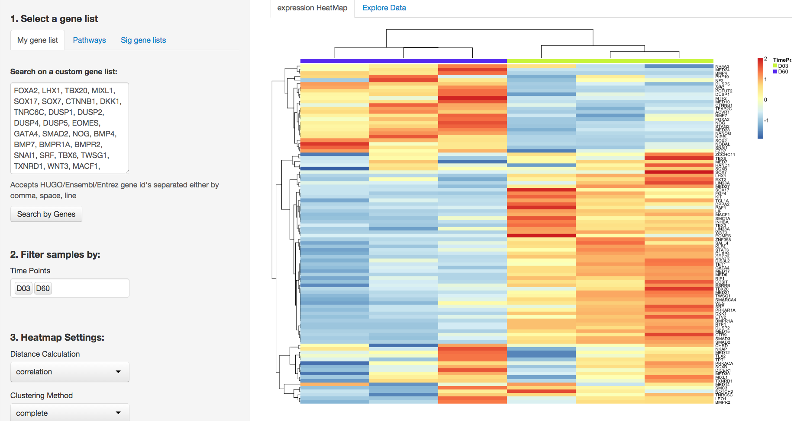
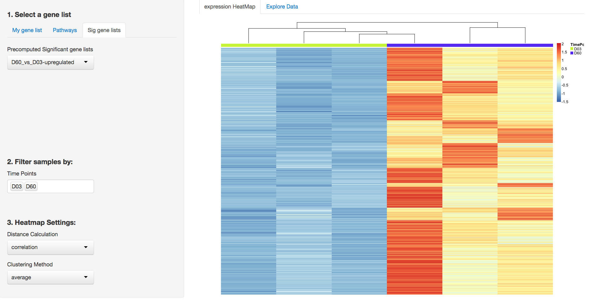
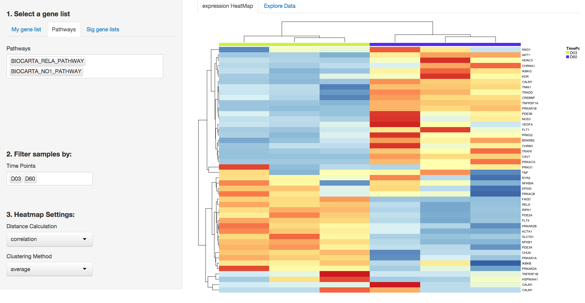

###A Shiny app to interact with PCBC CardiacDiff Data in [Synapse](https://www.synapse.org/#!Synapse:syn2582579/)
=========================

##### 1. Search based on a custom gene list

##### 2.Search based on pre-computed significant gene list

##### 3.Search based on KEGG/ Reactome/ BioCarta pathways

